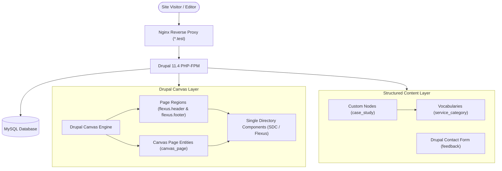
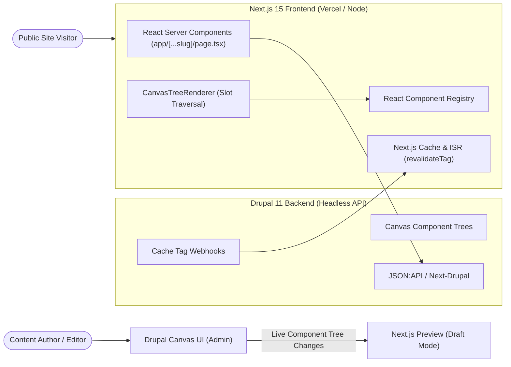

# Apex Digital Marketing — Drupal 11 & Drupal Canvas Reference Architecture

Welcome to the **Apex Digital Marketing** project repository. This site is built on **Drupal 11**, powered by the local development environment **Lerd**, and architected extensively around **Drupal Canvas** (the Next-Gen visual page building ecosystem) and the **Flexus** component theme.

---

## 🌐 Site Overview & Quick Links

- **Primary Site URL**: [https://drupal-lerd.test/](https://drupal-lerd.test/)
- **Visual Builder Dashboard**: [https://drupal-lerd.test/canvas](https://drupal-lerd.test/canvas) *(requires administrator login)*
- **Theme**: `flexus` (Single Directory Components + Tailwind/Utility system)
- **Framework**: Drupal 11 on PHP 8.5 (FPM) & MySQL via Lerd

---

## 🏗️ Architectural Overview



---

## 🧩 1. How Drupal Canvas Works

**Drupal Canvas** is a component-driven visual builder designed to provide freedom for site builders and content creators while maintaining strict component isolation and design system integrity.

### Core Canvas Concepts:

1. **Component Entities (`component`)**:
   - Canvas automatically discovers every **Single Directory Component (SDC)** declared by Drupal Core and installed modules/themes (such as `flexus`).
   - For every component (e.g. `sdc.flexus.cta`, `sdc.flexus.card`, `sdc.flexus.section`, `sdc.flexus.hero-side-by-side`, `sdc.flexus.form`), Canvas creates a `component` config entity.
   - Canvas computes a deterministic **`active_version` hash** derived from the component's `*.component.yml` JSON schema. This guarantees component schema consistency and prevents outdated props from breaking rendering.

2. **Component Trees & Props**:
   - Pages and regions in Canvas are stored as structured **Component Trees** (`component_tree` field type).
   - Each element in the tree contains:
     - `uuid`: Unique identifier for the component instance.
     - `component_id`: Machine name of the component (e.g. `sdc.flexus.hero-side-by-side`).
     - `inputs`: Key-value pair of props conforming to the component's JSON schema.
     - `parent_uuid`: UUID of the parent layout component (or `null` for root level).
     - `slot`: Target slot name within the parent component (e.g. `header_slot`, `main_slot`, `hero_slot`, `actions`, `accordion_content`).

3. **Page Regions (`page_region`)**:
   - `page_region` config entities define reusable global layouts such as headers and footers across an entire theme.
   - **`flexus.header`**: Houses `sdc.flexus.navbar` with slots for the branding block (`block.system_branding_block`) and main menu (`block.system_menu_block.main`).
   - **`flexus.footer`**: Houses `sdc.flexus.footer` with slots for social media icons (`sdc.flexus.icon`), footer utility menu (`block.system_menu_block.footer`), and copyright text (`sdc.flexus.text`).

4. **Canvas Pages (`canvas_page`)**:
   - Standalone visual landing pages created as first-class Drupal content entities.
   - Each `canvas_page` supports revisions, URL aliases, and interactive visual editing directly via `/canvas/editor/canvas_page/{id}` or the on-page Canvas HUD.

---

## 🎨 2. Flexus Theme & SDC Component Library

The site leverages the following Single Directory Components located in `web/themes/contrib/flexus/components/`:

| Component ID | Category | Description & Usage |
|---|---|---|
| `sdc.flexus.hero-side-by-side` | Hero | High-impact split hero with responsive banner image, aspect ratio control, corner radii, and content slot. |
| `sdc.flexus.section` | Layout | Multi-column flexible grid system (`100`, `50-50`, `33-33-33`, `25-25-25-25`). Supports `header_slot`, `main_slot`, and `footer_slot`. |
| `sdc.flexus.image` | Media | Responsive media with native **lazy loading** (`loading="lazy"`), aspect ratios (`21:5`, `16:9`, `4:3`), and interactive hover zoom (`group-hover:scale-105`). |
| `sdc.flexus.form` | Interaction | Interactive Drupal form embedding (Core Contact Forms & Webforms) with boxed input styling and configurable border radii. |
| `sdc.flexus.cta` | Marketing | High-conversion hero and call-to-action blocks with heading, summary, and `actions` slot for buttons. |
| `sdc.flexus.heading` | Typography | Responsive headings (H1–H6) with configurable sizing (`heading-responsive-4xl` to `8xl`) and alignment. |
| `sdc.flexus.text` | Typography | Rich-text paragraphs and body formatting. |
| `sdc.flexus.card` | Content | Feature and discipline cards supporting framed/borderless styles, vertical/horizontal orientations, and links. |
| `sdc.flexus.card-pricing` | Commerce | Tiered pricing comparison cards with frequency, feature bullet lists, and highlight ribbons (`promote: true`). |
| `sdc.flexus.card-testimonial` | Social Proof | Quote cards featuring client quotes, citation name, job title, and company. |
| `sdc.flexus.accordion-container` | Interactive | Accordion parent container managing collapsible FAQ items with smooth CSS animations. |
| `sdc.flexus.accordion` | Interactive | Collapsible individual accordion items with animated toggle chevron indicators. |
| `sdc.flexus.button` | Action | Styled CTA buttons with variants (`primary`, `secondary`, `outline`) and icon support. |
| `sdc.flexus.navbar` | Navigation | Responsive navigation bar with mobile burger menu and branding integration. |
| `sdc.flexus.footer` | Navigation | Multi-column responsive global footer with social links and legal links. |

---

## 📑 3. Information Architecture & Content Modeling

### 1. Canvas Landing Pages (`canvas_page`)
- **Homepage (`/home` -> `/`)**: Full-funnel agency showcase featuring:
  - Hero Side-by-Side banner with rich high-res marketing graphic and dual CTA buttons.
  - 3-column Service Highlights (SEO, PPC, CRO).
  - Interactive lazy-loaded analytics showcase image with hover effects.
  - Business Impact Metrics grid ($42M+ Revenue, 340% Growth, 5.4x ROAS, 98% Retention).
  - Client Testimonial cards.
  - Tiered Growth Retainer Pricing cards.
  - Interactive FAQ Accordions.
  - High-impact bottom CTA banner.
- **Services (`/services`)**: Hero Side-by-Side banner with in-depth capability breakdown across SEO, Paid Media, CRO, and Content Strategy.
- **Case Studies Hub (`/case-studies`)**: Hero Side-by-Side banner and client portfolio showcase linking directly to full case study nodes.
- **About Us (`/about`)**: Hero Side-by-Side banner, agency mission, guiding principles (Radical Transparency, Data Hypotheses, Profitability), and team spotlight CTA.
- **Our Team Sub-Section (`/about/team`)**:
  - Hero Side-by-Side header introducing growth strategists and engineers.
  - 3-column Executive Leadership grid (Marcus Vance, Sarah Jenkins, David Park).
  - 3-column Practice Leads grid (Conversion Engineering, Inbound Strategy, Paid Social).
  - Interactive Working Culture & Standards accordions.
- **Contact Us (`/contact`)**:
  - Hero Side-by-Side banner.
  - 50-50 Split Section: Left column with office hubs & direct channels; Right column with **Interactive Drupal Contact Form** (`sdc.flexus.form`).
  - Next-steps workflow accordion.
- **Privacy Policy (`/privacy-policy`) & Terms of Service (`/terms-of-service`)**.

### 2. Custom Content Type: Case Study (`case_study`)
- `title`: Project Title (e.g. *TechFlow SaaS: +340% Pipeline Growth*)
- `field_client`: Client name and industry
- `field_service_category`: Taxonomy reference to `service_category`
- `field_metric_highlight`: Key metric badge (e.g. `+340% Inbound Pipeline`)
- `body`: In-depth strategy narrative, challenges, and execution methodology
- `field_results_summary`: Bulleted list of quantifiable business achievements
- `field_image`: High-resolution project visual

### 3. Taxonomy: Service Category (`service_category`)
- Search Engine Optimization (SEO)
- Performance Paid Ads (PPC & Social)
- Content & Inbound Marketing
- Conversion Rate Optimization (CRO)
- Brand Identity & Web Design

### 4. Navigation Menus
- **Primary Menu (`main`)**:
  - Home (`/`)
  - Services (`/services`)
  - Case Studies (`/case-studies`)
  - About Us (`/about`)
    - **Our Team** (`/about/team`) *(Nested sub-page)*
  - Contact (`/contact`)
- **Footer Menu (`footer`)**:
  - Services (`/services`)
  - Case Studies (`/case-studies`)
  - About Us (`/about`)
  - Contact Us (`/contact`)
  - Privacy Policy (`/privacy-policy`)
  - Terms of Service (`/terms-of-service`)

---

## 🛠️ 4. Managing & Extending Canvas Pages

### Editing Pages Visually
1. Generate an admin one-time login link:
   ```bash
   lerd drush uli
   ```
2. Log into the Drupal administration dashboard.
3. Open the **Canvas Dashboard** at `https://drupal-lerd.test/canvas` or click **Edit in Canvas** when viewing any `canvas_page`.
4. Drag and drop components from the library panel into sections and slots.
5. Edit component properties in real-time in the sidebar inspector.

---

## 💻 5. Local Environment Commands (Lerd)

```bash
# Rebuild Drupal Cache
lerd drush cr

# Check Drupal Status
lerd drush status

# Generate Admin Login Link
lerd drush uli

# Run Database Updates
lerd drush updb -y

# Export Configuration
lerd drush config:export -y
```

---

## 🏛️ 6. Clean Extension Architecture (`apex_core`)

In adherence to Drupal and Composer best practices, **no core, contrib modules, or vendor libraries are modified**. All custom functionality, integrations, and bridges are encapsulated cleanly in custom modules:

- **Twig AST Compatibility Extension**:
  - `Drupal\apex_core\Template\TwigExtension` registers a custom `TwigNodeVisitor` tagged as `twig.extension`.
  - Seamlessly bridges Twig 3.x's AST compiler (`EscapeFilter` node handling) with Drupal 11's `TwigExtension::escapeFilter()`, ensuring that render arrays in component tree templates are processed properly without patching upstream packages.
- **PHP 8.4+ Null-Safe CVA Decorator**:
  - `Drupal\apex_core\Template\SafeCvaTwigExtension` decorates `cva.twig_extension` (`cva` contrib module) via Symfony service decoration.
  - Automatically sanitizes nullable props passed to `cva.apply()` in Single Directory Component templates, eliminating `Using null as an array offset is deprecated` notices under PHP 8.4+ without altering vendor code.

---

## 🎨 7. Child Theme Architecture (`apex_theme`)

To customize design tokens, extend component libraries, and layer custom CSS/JS behaviors on top of `flexus`, the project includes the custom child theme **`apex_theme`** (`web/themes/custom/apex_theme`):

- **Theme Inheritance**: Configured with `base theme: flexus` in `apex_theme.info.yml`.
- **Inherited Components**: Automatically inherits all Single Directory Components from `flexus` (`sdc.flexus.*`).
- **Custom SDCs**: Adds bespoke child theme components such as `sdc.apex_theme.stat-counter` (`web/themes/custom/apex_theme/components/stat-counter/`) featuring numerical count-up animations and glassmorphism styling.
- **Global Design Overrides**:
  - `css/apex-theme.css`: Declares custom glassmorphism classes (`.apex-glass-card`), gradient accents, and CSS custom properties.
  - `js/apex-theme.js`: Adds Drupal behavior scripts and IntersectionObserver-driven counter animations.

---

## ⚡ 8. Decoupled / Headless Architecture with Next.js

Drupal 11 with Drupal Canvas can be deployed in a **Decoupled / Headless architecture**, pairing Drupal's authoring experience and visual Canvas builder with a **Next.js (App Router + React Server Components)** frontend.

### Architecture Overview



---

### 1. Data Contracts: Canvas Component Tree JSON Payload

In a decoupled setup, Next.js fetches the `canvas_page` JSON:API endpoint (`/jsonapi/canvas_page/canvas_page/{uuid}`). The `component_tree` field returns a nested, flat, or mapped JSON tree:

```json
{
  "id": "e4f1a23b-4567-4890-abcd-123456789abc",
  "type": "canvas_page--canvas_page",
  "attributes": {
    "title": "Apex Digital Marketing - Home",
    "path": { "alias": "/" },
    "component_tree": {
      "0:hero_root": {
        "uuid": "hero-123",
        "component_id": "sdc.flexus.hero-side-by-side",
        "inputs": {
          "eyebrow": "DATA-DRIVEN ROI & PIPELINE GROWTH",
          "heading": "Scale Your Revenue with High-Performance Acquisition",
          "aspect_ratio": "16:9",
          "media": { "target_id": 2 }
        }
      },
      "0:hero_root:actions:btn1": {
        "parent_uuid": "hero-123",
        "slot": "actions",
        "uuid": "btn-456",
        "component_id": "sdc.flexus.button",
        "inputs": {
          "text": "Book Strategy Call",
          "href": "/contact",
          "variant": "primary"
        }
      },
      "1:stats_root": {
        "uuid": "stat-789",
        "component_id": "sdc.apex_theme.stat-counter",
        "inputs": {
          "number": 340,
          "prefix": "+",
          "suffix": "%",
          "label": "Average Pipeline Growth"
        }
      }
    }
  }
}
```

---

### 2. Next.js Dynamic Component Registry

Create a mapping between Drupal Canvas SDC IDs (`sdc.flexus.*`, `sdc.apex_theme.*`) and their React Server / Client component equivalents:

```tsx
// components/canvas/registry.tsx
import React from 'react';
import dynamic from 'next/dynamic';

export const ComponentRegistry: Record<string, React.ComponentType<any>> = {
  'sdc.flexus.hero-side-by-side': dynamic(() => import('@/components/HeroSideBySide')),
  'sdc.flexus.section': dynamic(() => import('@/components/Section')),
  'sdc.flexus.card': dynamic(() => import('@/components/Card')),
  'sdc.flexus.button': dynamic(() => import('@/components/Button')),
  'sdc.flexus.accordion': dynamic(() => import('@/components/Accordion')),
  'sdc.flexus.accordion-container': dynamic(() => import('@/components/AccordionContainer')),
  'sdc.flexus.form': dynamic(() => import('@/components/WebformHandler')),
  'sdc.apex_theme.stat-counter': dynamic(() => import('@/components/StatCounter')),
};
```

---

### 3. Recursive Component Tree Renderer

A universal dispatcher in Next.js traverses the component tree, matches parent-child slots, and renders components hierarchically:

```tsx
// components/canvas/CanvasTreeRenderer.tsx
import React from 'react';
import { ComponentRegistry } from './registry';

interface ComponentNode {
  uuid: string;
  component_id: string;
  inputs: Record<string, any>;
  parent_uuid?: string | null;
  slot?: string | null;
}

export function CanvasTreeRenderer({ 
  tree, 
  parentUuid = null, 
  slot = null 
}: { 
  tree: Record<string, ComponentNode>; 
  parentUuid?: string | null; 
  slot?: string | null;
}) {
  const nodes = Object.values(tree).filter(node => 
    (node.parent_uuid || null) === parentUuid && (node.slot || null) === slot
  );

  return (
    <>
      {nodes.map(node => {
        const Component = ComponentRegistry[node.component_id];
        if (!Component) {
          console.warn(`Missing React component for SDC: ${node.component_id}`);
          return null;
        }

        // Render child slots recursively as props or children
        const renderSlot = (targetSlot: string) => (
          <CanvasTreeRenderer tree={tree} parentUuid={node.uuid} slot={targetSlot} />
        );

        return (
          <Component 
            key={node.uuid} 
            {...node.inputs} 
            renderSlot={renderSlot}
            uuid={node.uuid}
          />
        );
      })}
    </>
  );
}
```

---

### 4. Next.js App Router Page Implementation

```tsx
// app/[...slug]/page.tsx
import { notFound } from 'next/navigation';
import { CanvasTreeRenderer } from '@/components/canvas/CanvasTreeRenderer';
import { draftMode } from 'next/headers';

async function getCanvasPage(path: string) {
  const { isEnabled: isDraft } = await draftMode();
  const endpoint = `${process.env.DRUPAL_BASE_URL}/jsonapi/canvas_page/canvas_page?filter[path.alias]=${encodeURIComponent(path)}`;

  const res = await fetch(endpoint, {
    next: {
      tags: [`canvas_page:${path}`, 'canvas_pages'],
      revalidate: isDraft ? 0 : 3600, // Instant update in preview, 1h ISR for production
    },
    headers: isDraft ? { 'Authorization': `Bearer ${process.env.DRUPAL_PREVIEW_TOKEN}` } : {},
  });

  if (!res.ok) return null;
  const json = await res.json();
  return json.data?.[0] || null;
}

export default async function Page({ params }: { params: Promise<{ slug?: string[] }> }) {
  const { slug } = await params;
  const path = `/${slug ? slug.join('/') : ''}`;
  const pageData = await getCanvasPage(path);

  if (!pageData) notFound();

  return (
    <main className="min-h-screen">
      <CanvasTreeRenderer tree={pageData.attributes.component_tree} />
    </main>
  );
}
```

---

### 5. Live Visual Preview in Drupal Canvas

Drupal Canvas supports decoupling through **Astro / Next.js Hydration bridges**:

1. **Draft Mode Endpoint (`/api/draft`)**:
   - Drupal Canvas passes a preview secret when opening the Next.js preview iframe.
   - Next.js enables `draftMode().enable()` and sets preview cookies.
2. **Bidirectional `postMessage` Communication**:
   - As an author changes props in the Drupal Canvas sidebar, Canvas emits:
     ```javascript
     iframe.contentWindow.postMessage({
       type: 'CANVAS_COMPONENT_UPDATE',
       uuid: 'stat-789',
       inputs: { number: 450 }
     }, '*');
     ```
   - A client-side React listener updates the component state in real time without refreshing the page.

---

### 6. Sub-Second Incremental Static Regeneration (ISR)

When editors publish changes in Drupal:
1. Drupal's `next` or `webhook` module emits a POST request to Next.js (`/api/revalidate?tag=canvas_page:/services&secret=...`).
2. Next.js executes `revalidateTag(tag)` instantly, purging the edge cache globally across Vercel / Cloudflare edge nodes without full site rebuilds.


